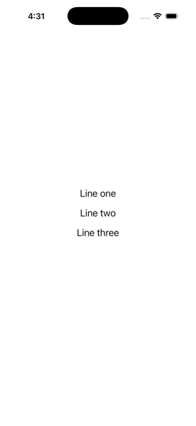

# SingleChildScrollView inside Center renders nothing

```sh
dn pub get
dn run                              # blank screen
dn run --dart-define=SCROLL=false   # same Center > Column, renders
```

| With the scroll view | Without |
|---|---|
|  |  |
