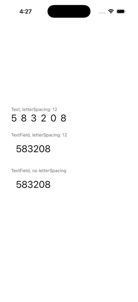

# TextField ignores style.letterSpacing

```sh
dn pub get
dn run
```

The same `TextStyle(fontSize: 28, letterSpacing: 12)` on a `Text` and on a
`TextField`: the `Text` is spaced, the field isn't.


